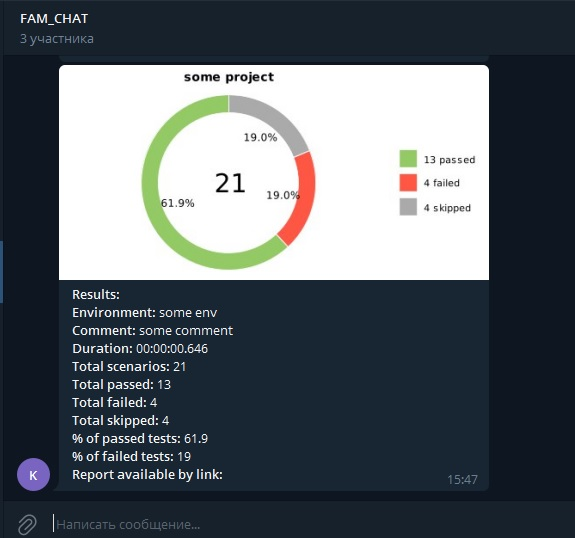

# Automation Tests (Jenkins, Properties examples + Telegram)

## Technology Stack
| <a href="https://www.jetbrains.com/idea/"></a> | <a href="https://www.jetbrains.com/idea/"></a> |<a href="https://www.jetbrains.com/idea/"></a> | <a href="https://www.jetbrains.com/idea/"></a> |<a href="https://www.jetbrains.com/idea/"></a> | <a href="https://www.jetbrains.com/idea/"></a> | <a href="https://www.jetbrains.com/idea/"></a> | <a href="https://www.jetbrains.com/idea/"></a> |
|:---------------------------------------------------------------------------------------------------------------------------------------------------------:| :---------: | :---------: | :---------: | :---------: |:-------------------------------------------------------------------------------------------------------------------------------------------------------:|:------------------------------------------------------------------------------------------------------------------------------------------------------:|:---------------------------------------------------------------------------------------------------------------------------------------------------------:|
|                                                                           IDEA                                                                            | Java | Junit5 | Gradle | Selenide |                                                                         Allure                                                                          |                                                                        Jenkins                                                                         |                                                                         Telegram                                                                          |

See details:  
```bash
Jenkins:
1.1 https://jenkins.autotests.cloud/job/011_KDS_homework11/

2.1. https://jenkins.autotests.cloud/job/011_KDS_homework11_2.1/ 
 (for https://github.com/Docent321/qa-guru-10-Jenkins )
2.2. https://github.com/kdimkin1/KDS_AT_JENKINS.git

Telegram:
https://jenkins.autotests.cloud/job/011_KDS_homework12_telegram/
